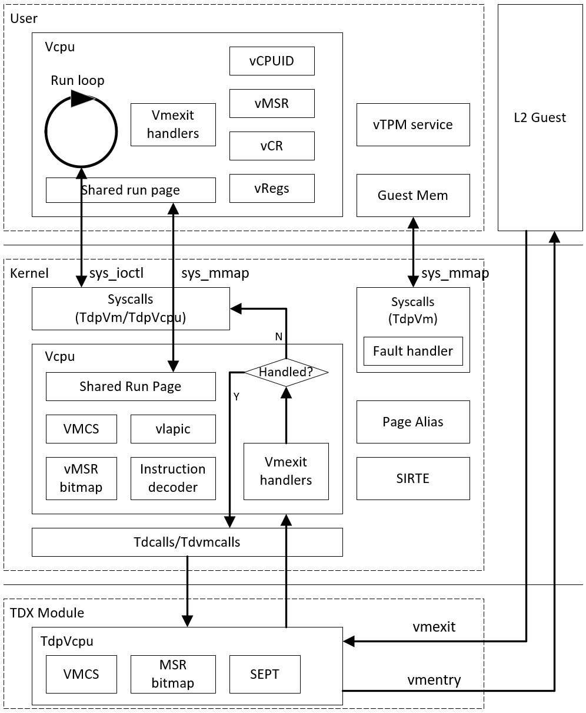
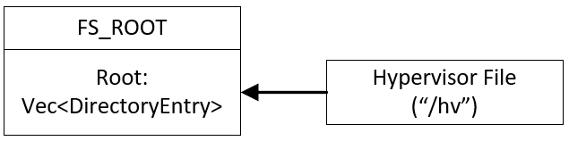
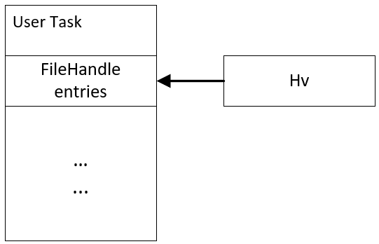
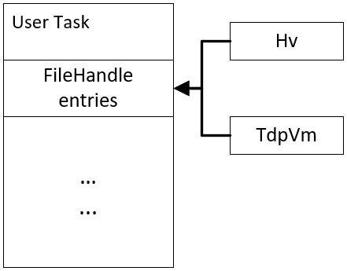
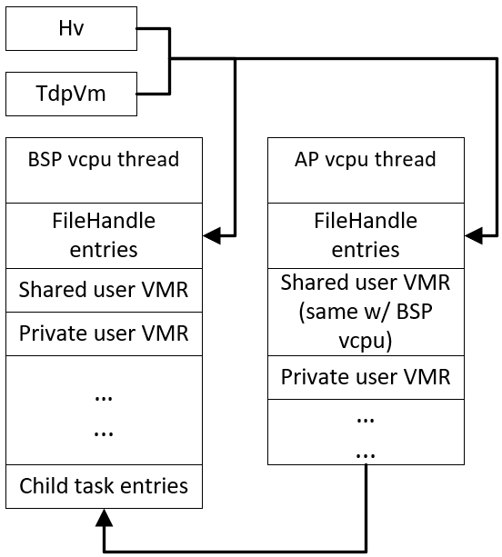
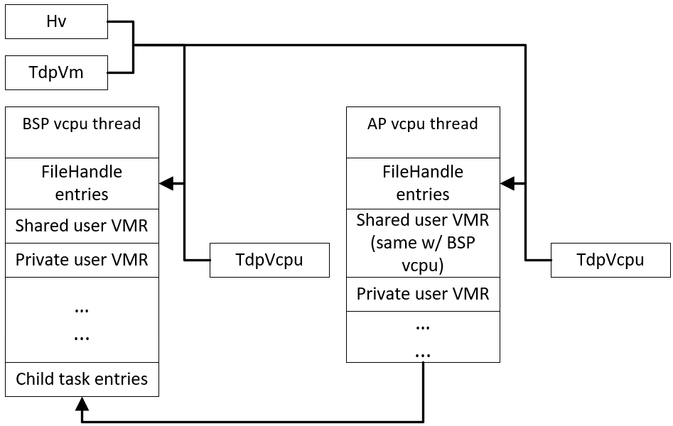
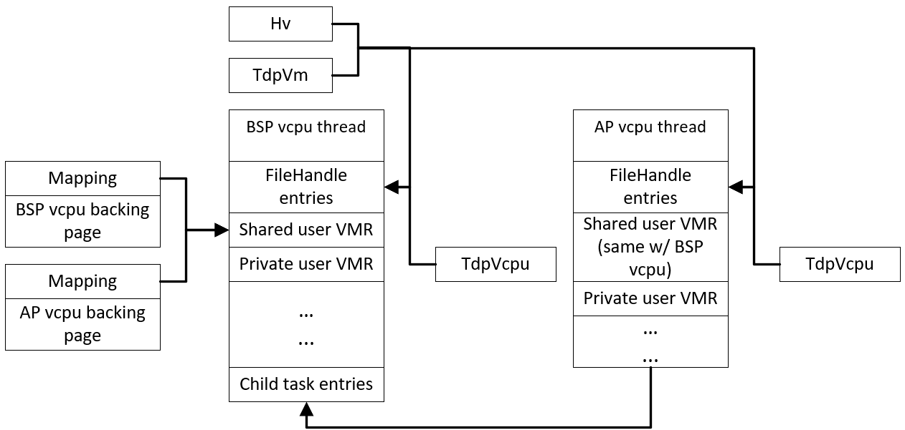
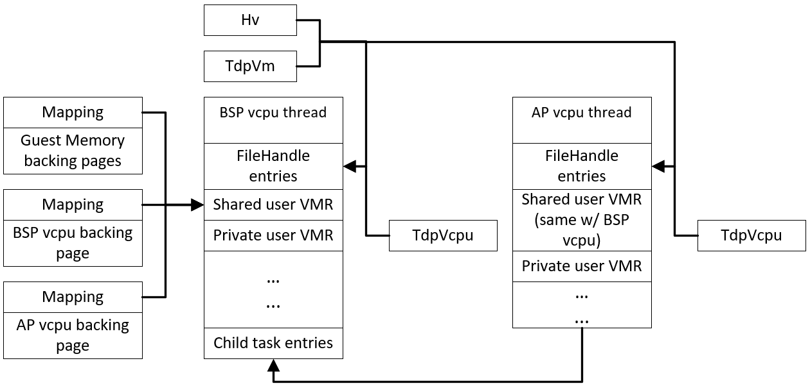
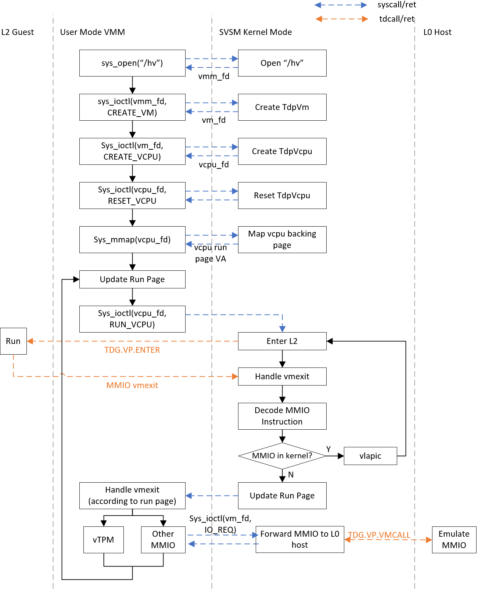

# Background

The TD partitioning VMM was implemented fully in the coconut-svsm kernel mode, which runs the coconut-svsm as a L1 VMM in TD and a Linux OS as a L2 guest. The code is published [here](https://github.com/intel-staging/td-partitioning-svsm/tree/svsm-tdp).

Following the coconut-svsm development plan, most parts of this TD partitioning VMM should be moved to the user mode for security reasons, while keeping the necessary parts left in the svsm kernel. This document is focusing on talking about the split VMM architecture in the high level and major interfaces for the split VMM between the user mode and the kernel mode.

# User Mode Restrictions

## 1\. Tdcall instruction is not allowed

According to [Intel TDX CPU Architecture Extension](https://cdrdv2.intel.com/v1/dl/getContent/733582) Section 2.3 Instruction Set Reference TDCALL, the user mode is not allowed to execute the tdcall instruction as this can cause #GP when CPL > 0. Due to this restriction, any operation done via tdcall cannot be performed in the user mode, e.g.:

- Accessing VMCS, modifying MSR bitmap, configuring L2 VM control (TDG.VP.RD/WR)
- Entering L2(TDG.VP.ENTER)
- Adding page alias(TDG.MEM.PAGE.ATTR.WR)
- All kinds of tdvmcall with host VMM(TDG.VP.VMCALL)

# The Big Picture for The Split TDP VMM

With the above user mode restriction, the tdcall instruction related parts are kept in the kernel mode. While considering the performance, vLAPIC and instruction decoder are also kept in the kernel mode. Below is a big picture of the split VMM architecture.

The SVSM kernel will create the TdpVm and TdpVcpu, which implement the File trait and act as the VMM interfaces between the user mode and the kernel mode. The user mode VMM can use the open syscall to open the TdpVm/TdpVcpu files and use the ioctl syscall to run corresponding services provided by the kernel mode VMM. The user mode VMM can also use the mmap syscall to map the backing memory of the TdpVm/TdpVcpu to its address space.

In this split architecture, the user mode VMM responds to create vcpu threads, which each thread maintains a vcpu instance that contains the vcpu contexts (e.g., cpuid/msr/control registers/general purpose registers). The vcpu thread runs the loop of entering L2 and handling L2 vmexit reasons. The user mode VMM also responds to provide the secure device emulation, e.g., vTPM.

The kernel mode VMM responds for tdcall related functionalities, e.g.:

- Setup the VMCS.
- Modify the MSR bitmap.
- Add page alias.
- Inject interrupt.
- Send the IO request TDG.VP.VMCALL to host VMM.
- Handle page conversion via MapGpa tdvmcall.
- Do the L2 vmentry.

The kernel mode VMM is the first place to reach upon a L2 vmexit, which records the detailed vmexit information onto a page shared with the user mode VMM. This allows the vcpu thread to retrieve the vmexit information from the shared page once it returns to the user mode so that can handle the vmexit accordingly. But as the kernel mode VMM has certain functionalities aforementioned, some vmexit reasons can be handled directly in the kernel mode without switching back to the user mode. For example:

- The EPT violation caused by missing page alias can be handled in the kernel mode.
- As virtual LAPIC is emulated in kernel mode, the xAPIC MMIO and x2APIC MSR vmexit can be emulated in the kernel mode.

The instruction decoding will be mostly done in the kernel mode for performance reasons. Take vTPM MMIO read instruction as an example, the kernel mode VMM decodes the MMIO read instruction and then returns to the user mode to emulate vTPM MMIO reading. Once this is done, go back to the kernel mode VMM to complete the instruction emulation and enter the TDP guest again.

# Required Syscalls Interfaces

- File based syscall ABI are used as the VMM interfaces between the user mode and the kernel mode. The following may be required:
  - sys_open/close: open/close a file.
  - sys_ioctl: call the functionalities implemented by a file in the kernel mode.
  - sys_mmap/munmap: map/unmap the backing pages provided by a file (e.g., the shared run page and guest memory) to/from the user mode task's address space.
- The user mode VMM creates multiple threads to represent multiple vcpus. Each vcpu thread runs on a dedicated CPU. The following syscalls may be required:
  - sys_clone: clone the calling thread while sharing its user mode address space (excluding the stack) and inheriting its opened file descriptors. And run the start entry on the specified CPU.

# Hypervisor File

The Hypervisor file is used as the interface for the user mode VMM to request services provided by the kernel mode VMM, for example, asking for creating a VM.

The Hypervisor file is created by the svsm kernel before launching the init process. As it implements the File trait, the svsm kernel can add it to the FS_ROOT with the name "/hv" as shown below.

The user mode VMM can open the hypervisor file via sys_open("hv") and ask the SVSM kernel mode to create VMs via sys_ioctl.

## 1\. Open hypervisor file

Introduce the sys_open to get a file descriptor of a specific file. The full path of this file is the input parameter to the sys_open.

The sys_open handler in the kernel mode opens the file with the given path to get the corresponding FileHandle. This FileHandle is inserted into the FileHandles entries in the current task structure, to indicate this file is opened by this task, as shown below.

Then a unified number(e.g., the index to insert) is generated and returned to the user mode as the hypervisor file descriptor.

## 2\. Hypervisor ioctl

Introduce the sys_ioctl for requesting a particular service provided by a file in the kernel mode. The sys_ioctl takes the file descriptor number, ioctl operation code and corresponding parameters as the input.

The sys_ioctl handler in the kernel mode retrieves the FileHandle from the FileHandle entries of the current task structure according to the input file descriptor number and calls the implemented ioctl method of the File trait to perform a particular action according to the inputs.

The VMM implements the ioctl method to provide certain hypervisor related services to the user mode. Below is a list of the hypervisor ioctl which may be needed (not settled, could be changed depending on the implementation details):

- MAX_NUM_L2_VMS - Query how many guests should be created. For TD partitioning, this is decided by the host QEMU command line parameter "num-l2-vms". SVSM kernel can get this number via using TDCALL instruction.
- CREATE_VM - For TD partitioning, create a TdpVm object which implements the File trait to represent a VM instance in the kernel mode VMM, and return a unified number as the VM file descriptor.
- GET_MEM_REGION - Query the memory regions reserved for the guests to use. This can be referenced by the user mode VMM to map guest memory to its own address space.

# VM File

VM file is an anonymous file which only implements the File trait but doesn't have to be added to the ram file system. This file acts as the interface for the user mode VMM to request a particular VM related service.

## 1\. Open VM file

The VM file is created via using VMM ioctl CREATE_VM.

For TD partitioning, the kernel mode VMM creates a TdpVm object with the specified TDP VM ID by the ioctl. The TdpVm implements the File trait, so that it can be wrapped as a FilHandle and stored in the current task FileHandle entries, which is similar as what the sys_open does. Then a unified number(e.g., the index to insert) is generated and returned to the user mode code as the file descriptor.

If a TdpVm object is already created with the associated TDP VM ID, the CREATE_VM ioctl can return with -EEXIST error code instead of a valid file descriptor.

## 2\. VM ioctl

Similar to the hypervisor file, the VM file also implements the ioctl method in the File trait, to provide certain VM related services to the user mode VMM. Below is a list of the VM ioctl which may be needed (not settled, could be changed depending on the implementation details):

- GET_VCPU_NUM - Query the number of L2 vcpu. This number equals the count of online CPUs brought up by SVSM. With this number, the user mode VMM can know how many vcpu threads should be created.
- CREATE_VCPU - Create a TdpVcpu object which implements the File trait, to represent a vcpu instance in the kernel mode VMM and return a unified number as file descriptor to the user mode VMM.

# Vcpu Threads

The user mode VMM can create multiple vcpu threads, which each run on a dedicated CPU and perform the vcpu run loop, e.g, enter L2 and handle L2 vmexit. The BSP vcpu thread is the task thread created to launch the user mode VMM ELF binary. The AP vcpu threads are created by the BSP vcpu thread.

## 1\. Create vcpu threads

Introduce the sys_clone to create a vcpu thread based on the calling thread. The sys_clone needs to take the thread entry point and the target CPU index as the input parameters.

The sys_clone handler in the kernel mode creates a new user task structure and shares several objects with the current task. To simplify, a cloned thread may not be able to support this syscall. The sys_clone handler will:

- Allocate a unified task ID, which will be returned to the user mode as the thread ID.
- Check the input target cpu index. If the target CPU is the current CPU, start to create a new user task structure with the new task ID.
  - Reuse the source task's (the current task is the source) shared user mode address mappings page table for the cloned task. A task structure may need to have two vm_user_range. One is used to contain VMM which can be shared among the threads, and the other one is used to contain its private VMM, like the user mode stack. The page table pages for the shared vm_user_range are reused so that any new VMM inserted to this shared vm_user_range is visible to each other. The page table pages for the private vm_user_range are separated.
  - Inherit the existing FileHandle entries of the source task, so that any already opened file by this task is visible to the cloned thread. But any new file which is opened by the cloned thread is not visible to the others.
  - Save the source task pointer in the cloned task structure as its parent task.
  - Insert the cloned task pointer to the child task entries of the source task structure.
  - Insert the cloned task pointer to the global TASKLIST and schedule.
- If not, send IPI to notify the target CPU to clone with the current task (which is the source task) ID and the new task ID, then wait for the new task to change to the running state. This will require the SVSM kernel to have a smp call mechanism.
  - The target CPU retrieves the task pointer from the global TASKLIST according to the current task ID, as the source task.
  - Create a new user task similar as what the sys_clone does in the above.
- Return the new task ID to the user mode.

So, the vcpu threads created via sys_clone will have the same visibility to the memory mapped/unmapped by any of vcpu thread, e.g. the guest memory mapped by one vcpu thread can be accessed by the other vcpu threads as well, and the guest memory unmapped by one vcpu thread is in-accessible to the other vcpu threads as well.

To inherit the hypervisor file and VM file, the BSP vcpu thread can create AP vcpu threads with these two files opened.

The task relationship among the vcpu threads is shown as below:

# Vcpu File

Similarly, the user mode VMM can obtain a vcpu file descriptor from the kernel, which can be used as the interface to request the functionalities provided by the kernel mode VMM for running a vcpu.

## 1\. Open vcpu file

Once the vcpu thread starts running, it gets the vcpu file descriptor via the VM file ioctl CREATE_VCPU.

This ioctl method implemented by TdpVm creates a TdpVcpu object identified by the current CPU APIC ID. The TdpVcpu object implements the File trait so that it can be wrapped as a FilHandle and stored in the current vcpu thread task, which is similar as what the sys_open does. A backing page is allocated associated with this TdpVcpu, which is going to be shared with the user mode VMM and used as the vcpu run page. Below figure shows the tasks relationship with their corresponding files.

Just like the sys_open, a unified number(e.g., the index to insert) is generated and returned to the user mode code as the vcpu file descriptor for a L2 vcpu. If the TdpVcpu identified by the current CPU APIC ID is already created, the ioctl returns with -EEXIST error code.

## 2\. Vcpu ioctl

Similar as the VM file descriptor, the vcpu file descriptor also provides the ioctl support to the user mode VMM, to allow the user mode VMM to request certain vcpu related services provided by the kernel mode VMM. Below is a list of the vcpu ioctl which may be required (not settled, could be changed depending on the implementation details):

- RESET_VCPU - The user mode VMM manages the vcpu state machine in the vcpu run loop. A vcpu should be reset before transitioning to a running state. Virtual LAPIC is emulated in the kernel mode, a vcpu reset should also include vLAPIC reset. So, this ioctl can be used by the user mode VMM to cooperate with the kernel mode VMM to complete a full vcpu reset.
- RUN_VCPU - The user mode VMM is not allowed to use tdcall instruction. So, the vcpu run loop will need this ioctl to switch into the kernel mode to do the L2 vmentry.
- GET/SET_VCPU_REG - To read and modify the vcpu registers maintained by the kernel mode VMM, e.g., register in the VMCS.
- GET/SET_VLAPIC_REG - The virtual LAPIC is still emulated in the kernel mode. The user mode VMM may need to access vLAPIC register to emulate, e.g., cpuid which contains vLAPIC ID.
- GET/SET_MSR_BITMAP - To facilitate the user mode VMM changing the intercept behavior for a specific MSR.
- IO_REQ - As the user mode is not able to directly execute the tdcall instruction to request L0 host to emulate specific MMIO or PIO, introduce this ioctl to ask the kernel mode VMM to send a specific MMIO or PIO request to the L0 host.
- MSR_REQ - As the user mode is not able to directly execute the rdmsr/wrmsr instruction, introduce this ioctl to ask the kernel mode VMM to read/write a specific MSR.
- VMCS_REQ - Similar with IO_REQ, tdcall instruction cannot be executed by the user mode, introduce this ioctl to ask the kernel mode VMM to access a specific VMCS field.

# Vcpu Run Page

The vcpu run page is a shared page between the user mode and the kernel mode. This is a per vcpu page. The kernel mode VMM can set the information required by handling a vmexit before switching to the user mode. And the user mode VMM can set the vmeixt handling result required by entering L2 before switching to the kernel mode.

## 1\. Map vcpu run page

Introduce the sys_mmap to map a particular file into the user mode address space. The sys_mmap takes the file descriptor, offset, size and flags as the input parameters.

The sys_mmap handler in the kernel mode retrieves the FileHandle according to the input file descriptor number and calls the mmap method of the File trait with the input offset, size and flags.

The mmap method can be implemented to create a VMM for its backing pages. If the flag is shared, insert the VMM to the shared vm_user_range of the current task structure. Otherwise, insert the VMM to the private vm_user_range. A user mode virtual address is allocated and returned to the user mode. The mapping for this virtual address can be populated in the page table immediately before returning to the user mode or deferred when handling the page fault caused by the user mode accessing this virtual address.

The backing page of the TdpVcpu is designed as the vcpu run page, which is mapped as shown by below figure.

# VM Memory

The hypervisor file is designed by having the TDP guest memory as the backing pages. To access guest memory, the user mode VMM can use the sys_mmap with the hypervisor file descriptor, to map these backing pages to its own address space.

## 1\. Map VM Memory

The ioctl GET_MEM_REGION provided by the hypervisor file tells the memory regions can be used by the TDP guests. The memory region is described by a physical address and the size. The user mode VMM can map this memory region in its user mode address space via the sys_mmap, by taking the hypervisor file descriptor, region information (physical address as offset, size) and flags as the input parameters. To make sure this memory region visible to the other vcpu threads, a shared flag should also be used.

The mmap method implemented by the hypervisor file is the same with the mmap method of the vcpu file, which inserts the corresponding Mapping of its backing pages to the current task's shared user VMR, as shown in below figure.

The user mode virtual address for the backing page is returned to the user mode VMM. Considering populating the page table during mmap may take time if the guest memory region is very large, deferred map is preferred. So, the page fault exception can happen when accessing this virtual address in user mode and is eventually handled by the page fault method in the File trait implemented by the hypervisor file.

As guest memory could be converted from private to shared, or shared to private, the page fault method should be implemented to map the backing page with the corresponding shared/private bit.

# Vcpu Run Loop

The vcpu thread in the user mode VMM runs the loop of entering L2 and handling L2 vmexit reasons. Not all vmexit reasons are handled in the user mode VMM as mentioned in the above section.

Taking the MMIO vmexit as an example, the MMIO in the range of vLAPIC is handled by the kernel mode vLAPIC emulation code. The other MMIO will be handled by the user mode VMM. In the user mode, the MMIO in the range of vTPM will be emulated by vTPM service, and the reset will be emulated by sending the MMIO request to L0 via the ioctl IO_REQ (as mentioned in the above section, the user mode cannot directly execute tdcall instruction to send any MMIO request to L0. For better performance, the emulation for this kind of MMIO may be kept in the kernel mode to avoid the user/kernel context switches) as L0 emulates the reset device models, e.g., PCI configuration, virtio devices. Below figures shows the vcpu run loop with handling MMIO vmexit as an example.

