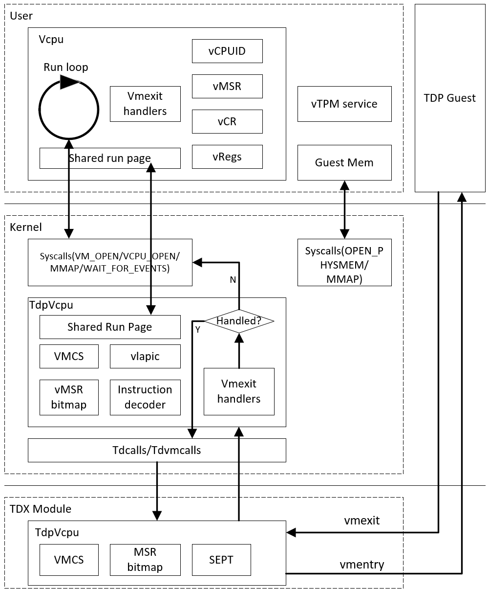
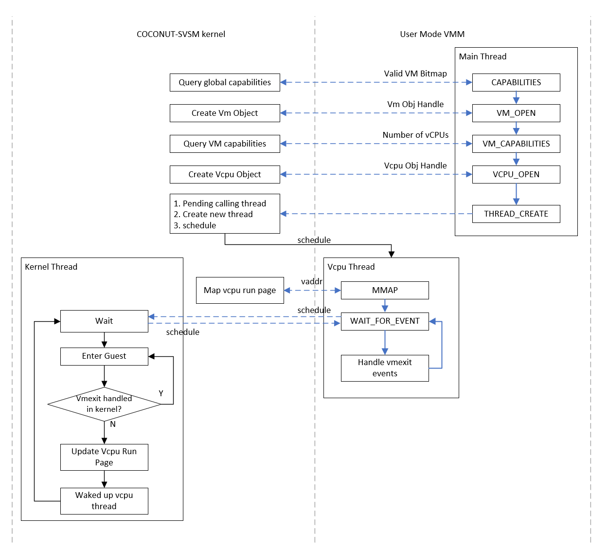

# Background

The TD partitioning VMM was implemented fully in the COCONUT-SVSM kernel mode,
which runs the COCONUT-SVSM as a L1 VMM in TD and a Linux OS as a L2 guest. The
code is published
[here](https://github.com/intel-staging/td-partitioning-svsm/tree/svsm-tdp).
Following the COCONUT-SVSM development plan, most parts of the TD partitioning
VMM should be moved to the user mode for security reasons, while only keeps the
necessary parts in the kernel.

Similar for the SEV, the protocol requests from SEV-SNP guest now are handled by
COCONUT-SVSM kernel, which should also be moved to the user mode.

So this document will describe a straightforward implementation for the user
mode VMM utilizing the syscalls outlined in the
[X86-64 Syscall API/ABI Document](https://mail.8bytes.org/pipermail/svsm-devel/2024-June/000334.html).

# TDX User Mode Restrictions

According to
[Intel TDX CPU Architecture Extension](https://cdrdv2.intel.com/v1/dl/getContent/733582)
Section 2.3 Instruction Set Reference TDCALL, the user mode is not allowed to
execute the tdcall instruction as this can cause #GP when CPL > 0. Due to this
restriction, any operation done via tdcall cannot be performed in the user mode,
e.g.:

- Accessing VMCS, modifying MSR bitmap, configuring L2 VM control (TDG.VP.RD/WR)
- Entering L2(TDG.VP.ENTER)
- Adding page alias(TDG.MEM.PAGE.ATTR.WR)
- All kinds of tdvmcall with host VMM(TDG.VP.VMCALL)

# VMM High Level Architecture

With the above user mode restriction for TDX, the tdcall instruction related
parts are kept in the COCONUT-SVSM kernel. While considering the performance,
vLAPIC and instruction decoder are also kept in the COCONUT-SVSM kernel. Below
is a high level architecture for the VMM:


In this architecture, the user mode VMM responds to create vcpu threads, which
each thread maintains a vcpu instance that contains the vcpu contexts (e.g.,
cpuid/msr/control registers/general purpose registers). The vcpu thread runs the
loop of entering guest and handling guest vmexit events. The user mode VMM also
responds to provide the secure device emulation, e.g., vTPM.

The COCONUT-SVSM kernel responds for tdcall related functionalities, e.g.:

- Access VMCS
- Modify the MSR bitmap.
- Inject interrupt.
- Send tdvmcalls to host VMM(e.g. IO/MMIO requests, page conversion).
- Do vmentry.

The COCONUT-SVSM kernel records the detailed vmexit information in a page shared
with the user mode VMM. This allows the vcpu thread to retrieve the vmexit
information from the shared page once it returns to the user mode for handling
the vmexit events. But as the COCONUT-SVSM kernel has certain functionalities
aforementioned, some vmexit reasons can be handled directly in the COCONUT-SVSM
kernel without switching back to the user mode. For example:

- The EPT violation caused by missing page alias mapping in secure EPT.
- The virtual LAPIC MMIO/MSR vmexit.

The instruction decoding will be done in the kernel mode for performance
reasons. Taken vTPM MMIO read instruction as an example, the kernel thread
decodes the MMIO read instruction to get detailed MMIO address/data, and then
wakes up the the user mode vTPM thread which is waiting on vTPM MMIO event to
emulate. Once this is done, the user mode vTPM thread wakes up the kernel thread
and waits for vTPM MMIO event again. Then the kernel thread completes the
instruction emulation (writing back the emulated result) and enter the guest.

# User Mode VMM

The user mode VMM is used to launch guest VM, and handle various vmexit events
with necessary support from the COCONUT-SVSM kernel. It is compiled as a
dedicated ELF, wrapped in the SVSM ram file system binary, and launched by the
init process.

## Main Thread

The user mode VMM starts to run at the main thread. It queries the valid VM
bitmap via the `CAPABILITIES` syscall, and gets the `VmObjHandle` for the first
valid VM from the COCONUT-SVSM kernel via `VM_OPEN` syscall. With the
`VmObjHandle`, the user mode VMM can get the supported number of vCPUs via the
`VM_CAPABILITIES` syscall, so that the main thread can create dedicated vcpu
thread for each vcpu via the `THREAD_CREATE` syscall.

```Rust
struct ObjHandle(u32); // A raw object handle
struct VmObjHandle(ObjHandle); // Represents vm object handle
```

### Create Vm Structure

The main thread creates a Vm structure to represents an opened VM, which
contains a `VmObjHandle` get via the `VM_OPEN` and the number of vcpu via the
`VM_CAPABILITIES`. Dropping the structure Vm should result in calling the
`CLOSE` syscall to close its `VmObjHandle`.

```Rust
struct Vm {
  handle: VmObjHandle, // vm object handle
  nr_vcpus: u64, // supported number of vCPUs
  <!-- More fields can be extended in the future -->
}
```

### Create Vcpu Thread

The main thread will get a `VcpuObjHandle` via the `VCPU_OPEN` syscall and start
a dedicated vcpu thread via the `THREAD_CREATE` syscall for each vcpu.

The `THREAD_CREATE` takes `X86Regs` as the input parameter, which is used as the
initial context for the new created thread. The `rip` should be set with the
entry point. To allow passing input parameters to the entry point, the registers
e.g., `rdi`, `rsi` should also be set. The created thread should share certain
user mappings with the parent(caller), like text/data sections, heap area, but
not the stack area. This will require the `struct task` in kernel to have two
separate user `VMR`, one is shared virtual memory range, which maps the
text/data/heap and the other is private virtual memory range, which maps the
stack. The parent task may need to record which tasks has been created, and a
child task may also need to know which task is the parent. This is useful when
terminate tasks. After a thread being created, the parent can use `THREAD_JON`
syscall to wait for the child task finishing execution. So the `struct task` may
require a `WaitQueue` for the parent task to wait. Below shows the new fields
for `struct task` in the kernel mode:

```Rust
// Task structure in the COCONUT-SVSM kernel
struct task {
    <!-- Original fields -->
    /// Task shared virtual memory range for use at CPL 3 - None for kernel tasks
    vm_user_shared_range: Option<Arc<VMR>>,
    /// Task private virtual memory range for use at CPL 3 - None for kernel tasks
    vm_user_private_range: Option<VMR>,
    /// Chile threads created by this task
    threads: RWLock<BTreeMap<u32, Arc<Task>>>,
    /// Parent task ID
    parent_id: Option<u32>,
    /// Wait queue to hold pending tasks which are joining this task
    join_wq: SpinLock<WaitQueue>,
}
```

As the `VcpuObjHandle` is created by the main thread, it should be moved to the
vcpu thread, which would be implemented by using a closure with moving the
`VcpuObjHandle` from the main thread to the closure. The `rdi` and `rsi` of the
`X86Regs` structure would be initialized by the raw pointers of the boxed
closure, and the `rip` would be the entry point of the vcpu thread which takes
the boxed closure raw pointer as the input and executes this closure. As the
vcpu thread shares the user mappings text/data/heap with the main thread except
for the stack, the closure and the moved `VcpuObjHandle` are able to be accessed
by the vcpu thread.

```Rust
struct VcpuObjHandle(ObjHandle); // Represents vcpu object handle

/// The vcpu thread entry point
fn vcpu_thread(entry: *mut (dyn FnOnce() -> u32 + Send + 'static)) {
    let main: Box<dyn FnOnce() -> u32 + Send + 'static> = unsafe { Box::from_raw(entry) };
    main();
}

/// Create vcpu thread with a boxed closure
fn dm_create_vcpu_thread(entry: Box<dyn FnOnce() -> u32 + Send + 'static>) -> Result<Tid, DmError> {
    let (data, vtable): (*const (), *const ()) =
        unsafe { core::mem::transmute(Box::into_raw(entry)) };

    let regs = X86Regs {
        rdi: data as usize as u64,
        rsi: vtable as usize as u64,
        rip: vcpu_thread as usize as u64,
        ..Default::default()
    };

    thread_create(regs).map_err(|_| DmError::VcpuThreadCreate)
}

fn dm_run() -> Result<(), DmError> {
    ...
    for idx in 0..vm.nr_vcpus() {
        // Get `VcpuObjHandle` via VCPU_OPEN syscall
        let vcpu = vcpu_open(vm.handle(), idx as u32).map_err(|_| DmError::VcpuOpen)?;

        // Move `VcpuObjHandle` to the boxed closure and create the vcpu thread
        let tid = dm_create_vcpu_thread(Box::new(move || -> u32 { vcpu_run(vcpu) }))?;

        ...
    }
    ...
}

```

After all the vcpu threads being created, the main thread can use the
`THREAD_JOIN` syscall to wait for each vcpu thread to finish its execution, if
it doesn't need to wait for any other event.

## Vcpu Thread

The vcpu thread responses for running a vcpu via `WAIT_FOR_EVENT` syscall, and
handling various vmexit events after being waked up. The detailed vmexit event
information is stored in a 4KiB page provided by the vcpu object, which can be
mapped to the vcpu thread's address space via `MMAP` syscall.

### Create Vcpu Structure

A Vcpu structure is created by the vcpu thread to represent an opened VCPU. It
contains the `VcpuObjHandle` which is the input parameter of the entry point,
and a vcpu run page which points to the mapped 4KiB page provided by the vcpu
object. Dropping the Vcpu structure should result in munmap the vcpu run page
via `MUNMAP` syscall and close the opened vcpu object via `CLOSE` syscall.

```Rust
struct VcpuRunPage(i64); // Represents vcpu run page address via MMAP syscall.

struct Vcpu {
  handle: VcpuObjHandle, // vcpu object handle
  run_page: VcpuRunPage, // vcpu run page
  <!-- More fields can be extended in the future -->
}
```

### Vcpu Run Page

The vcpu object in the kernel provides a 4KiB page, which is used as a shared
memory between the user mode and the kernel mode for communicating the vmexit
events at the runtime. Typically, the kernel mode can write detailed vmexit
event from the guest to this page before switching to the user mode vcpu thread.
The user mode vcpu thread can get the detailed vmexit event from this page and
update the handling result to this page before entering the kernel mode to do
vmenter.

The `MMAP` syscall can map this 4KiB vcpu run page into the user private virtual
memory range of the vcpu thread, as this is a per-vcpu page and no need to be
shared with the main thread or any other vcpu thread. A i64 is returned to the
user mode as the virtual address, which can be used to read from or write to
this 4KiB page.

The structure VcpuRunPage is defined to represent this 4KiB page, which contains
an Option<VcpuExitEvent> to represent a vmexit event.

```Rust
enum VcpuExitEvent {
  // Cpuid vmexit event
  Cpuid {
    leaf: u32,
    subleaf: u32,
    eax: u32,
    ebx: u32,
    ecx: u32,
    edx: u32,
  },
  // Protocol request event
  ProtocolReq {
    protocol: u32,
    request: u32,
    sev_features: u64,
    rcx: u64,
    rdx: u64,
    r8: u64,
  },
  <!-- More fields can be extended in the future -->
}

#[repr(align(4096))]
struct VcpuRunPage {
  exit_event: Option<VcpuExitEvent>, // Guest vmexit event
  <!-- More fields can be extended in the future -->
}
```

### Run Vcpu

The vcpu thread in the user mode cannot directly do vmenter. Instead, vm
entering is done by a per-cpu kernel thread which is created during COCONUT-SVSM
kernel booting time. After this per-cpu kernel thread being created, it starts
to wait until being waked up to do vmenter.

So to request vmenter by a user mode vcpu thread, it can use the
`WAIT_FOR_EVENT` syscall, which takes the `ObjHandle` (raw of the
`VcpuObjHandle`) as the input parameter. For the vcpu object, syscall will make
the vcpu thread waiting on the event belongs to the vcpu object, and wakes up
the corresponding per-cpu kernel thread to do vmenter. After vmexit happens from
the guest, the per-cpu kernel thread wakes up the vcpu thread and waits again.
When vcpu thread backs to the user mode, it can retrieve the vmexit event from
the vcpu run page and do the handling.

## Basic Flow Overview

With the aforementioned syscalls, the user mode VMM is able to run vcpu and
handle certain vmexit events. Below is an overview of this basic flow:

